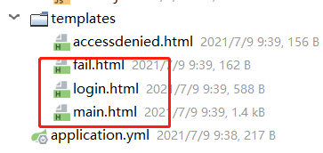

# SpringSecurity

# 1. 部署项目

## 1.1 导包

~~~xml
	<dependency>
        <groupId>org.springframework.boot</groupId>
        <artifactId>spring-boot-starter-security</artifactId>
        <version>2.4.5</version>
    </dependency>
~~~

## 1.2 账号密码设置

1. 若起初没有设置，可在控制台获得系统提供的一串打印字符

2. 也可通过**SpringSecurity**官方提供的接口UserDetailService自己声明

   ~~~java
   @Service
   public class UserDetailsServiceImpl implements UserDetailsService {
       
       @Override
       public UserDetails loadUserByUsername(String username) throws UsernameNotFoundException {
           
           String password = "123";
           UserDetails userd = new User(username, password, AuthorityUtils.commaSeparatedStringToAuthorityList("admin1,admin2,ROLE_admin3"));
           return userd;
          
       }
   }
   ~~~

   + 细节点：传入的参数password，直接传参，是行不通的，需要用官方提供的PasswordEncoder接口来对				密码加密，在传参

   ~~~java
   	@Test
       public void test001(){
           PasswordEncoder encoder = new BCryptPasswordEncoder();
   
           //加密
           String password = encoder.encode("lisi");
   
           System.out.println(password);
   
           System.out.println("s-----------------");
   
           //密码和加密是否匹配
           System.out.println(encoder.matches("123", password));
       }
   ~~~

   + 配置类配置PasswordEncoder

   ~~~java
   @Configuration
   public class SecurityConfig {
   
       @Bean
       protected PasswordEncoder passwordEncoder(){
           return new BCryptPasswordEncoder();
       }
   }
   ~~~

   

# 2. 修改官方提供的权限认证登录界面

## 2.1 WebSecurityConfigurerAdapter类

1. 创建一个继承WebSecurityConfigurerAdapter的类，并重写configure（HttpSecurity http）方法

   ~~~java
   @Configuration
   public class MyWebSecurityConfiguerAdapter extends WebSecurityConfigurerAdapter {
      
       @Override
       protected void configure(HttpSecurity http) throws Exception {
           
           http.formLogin()
                   // 控制器层requestmapping调取自己配置的security登录页面
                   .loginPage("/showLogin")
                   // form表单action的url，post
              		//当发现/login时认为是登录，需要执行UserDetailsServiceImpl
                   .loginProcessingUrl("/login")
                   // 认证成功后请求转发地址，也需要controller在调取成功的html，post请求
                   .successForwardUrl("/main");
                   // 失败跳转的页面
                   .failureForwardUrl("/showFail")
       
           http.authorizeRequests()
                   //不用批准的页面,响应重定向的失败页面也需要，否则不放行加载不进去
                   .antMatchers("/showLogin", "/showFail").permitAll()
                   //任何页面都需要批准
                   .antMatchers().denyAll()
                   .anyRequest().authenticated();
      
           http.csrf().disable();
       }
   }
   ~~~

2. controller层创建对应的请求路径

   **form表单里的/login路径被认为是登录，会执行1.2所提及的UserDetailsServiceImpl类**

   ~~~java
   @Controller
   public class MyController {
       
       @RequestMapping("/showLogin")
       public String s2(){
           return "login";
       }
   
       @RequestMapping("/main")
       public String s3(){
           return "main";
       }
   
       @RequestMapping("/showFail")
       public String s4(){
           return "fail";
       }
   }
   ~~~

   

3. 此时创建前端相对应的登录，失败，成功页面等

   + 导入thymeleaf包

   + 在templates包下创建**.html等相关页面

+ login.html

  ~~~html
  <!DOCTYPE html>
  <html lang="en">
  <head>
      <meta charset="UTF-8">
      <title>Title</title>
      <!---->
  </head>
  <body>
      <form action="/login" method="post">
          username: <input type="text" name="myUsername"/> 
          password:<input type="password" name="myPassword"/> 
          <input type="submit">
      </form>
  </body>
  </html>
  ~~~

# 3. 自定义403的异常处理类

>  登录后，有的网址没有权限，会报403异常的界面，对客户不是很友好，所以配置相关类以及页面

## 3.1 方式1：配置类

1. 配置类，返回json字符串

   ~~~java
   @Component
   public class MyAccessDeniedHandler implements AccessDeniedHandler {
       @Override
       public void handle(HttpServletRequest request, HttpServletResponse response, AccessDeniedException accessDeniedException) throws IOException, ServletException {
   
           //设置响应码403，不设置会显示200响应码
           response.setStatus(response.SC_FORBIDDEN);
           //编码格式
           response.setContentType("application/json;charset=utf-8");
           PrintWriter out = response.getWriter();
           //转义字符
           out.println("{\"status\":\"error\",\"msg\":\"权限不足，请联系管理员!\"}");
           out.flush();
           out.close();
   
       }
   }
   ~~~

   

2. 在配置登录页面的类中（2.1中所提及的类）配置

   注入

   ~~~java
   	@Autowired
       private MyAccessDeniedHandler myAccessDeniedHandler;
   ~~~

   配置

   ~~~java
   	http.exceptionHandling()
                   .accessDeniedHandler(myAccessDeniedHandler);
   ~~~

## 3.2 方式2：html页面展示

1. 在配置登录页面的类中（2.1中所提及的类）配置

   ~~~java
   		http.exceptionHandling()
                   //只适用于非前端框架的方式，适用于同步请求的方式，所有异步（Ajax）使用						accessDeniedHandler
                   .accessDeniedPage("/showAccessDeniedPage");
   ~~~

2. 在controller中配置请求路径

   ~~~java
   	@RequestMapping("/showAccessDeniedPage")
       public String s5() {
           return "accessDeniedPage";
       }
   ~~~

3. 配置accessDeniedPage.html页面

   ~~~html
   <!DOCTYPE html>
   <html lang="en">
   <head>
       <meta charset="UTF-8">
       <title>Title</title>
   </head>
   <body>
   您无权访问此页面
   </body>
   </html>
   ~~~

# 4. 角色，权限等问题

+ 2.1所创建的类中添加如下的配置

~~~java
		http.authorizeRequests()
				//权限判断
                .antMatchers("/authory").hasAuthority("admin1")
                .antMatchers("/mysql").hasAuthority("demo:update")
                //有其中一个就行
                .antMatchers("/b").hasAnyAuthority("abc", "admin1")
                // 请求是指定的IP就运行访问
                .antMatchers("/ip").hasIpAddress("192.168.58.1")
            	// 指定的角色	
                .antMatchers("/role").hasRole("admin2")
~~~

+ UserDetailServiceImpl类（1.2所创建）

  > admin1，admin2为权限
  >
  > ROLE_**为角色

  ~~~java
  UserDetails userd = new User(username, admin.getPassword(), AuthorityUtils.commaSeparatedStringToAuthorityList("admin1,admin2,ROLE_admin3"));
  ~~~

# 5. 自定义acess方法（基于表达式的访问控制）

> 之前学习的登录用户权限判断实际上底层实现都是调用access(表达式)

1. 在配置登录页面的类中（2.1中所提及的类）配置

   ~~~java
   http.authorizeRequests()
                   //自定义access方法  
       .antMatchers("/myservice").access("@myServiceImpl.hasPermission(request,
       authentication)")
   ~~~

2. 创建接口

   ~~~java
   public interface Myservice {
       boolean hasPermission(HttpServletRequest request, Authentication authentication);
   }
   ~~~

3. 创建其实现类

   ~~~java
   @Service
   public class MyServiceImpl implements Myservice  {
       @Override
       public boolean hasPermission(HttpServletRequest request, Authentication authentication) {
           Object o = authentication.getPrincipal();
           if (o instanceof UserDetails) {
               UserDetails user = (UserDetails)o;
               Collection<? extends GrantedAuthority> authorities = user.getAuthorities();
               return authorities.contains(new SimpleGrantedAuthority("ROLE_管理员"));
           }
           return false;
       }
   }
   ~~~

# 6. 基于注解的访问控制

> 使用注解后不用再配置类配置对应的权限配置

## 6.1 @Secured

> 判断是否具有**角色**的

在启动类(也可以在配置类等能够扫描的类上)上添加@EnableGlobalMethodSecurity(securedEnabled = true)

~~~java
@Secured("ROLE_管理员")
~~~

## 6.2 @PreAuthorize/@PostAuthorize

> 判断是否有**角色**和**权限**的
>
> 1. **@PreAuthorize**表示访问方法或类在执行之前先判断权限，大多情况下都是使用这个注解，注解的参数和access()方法参数取值相同，都是权限表达式。
>
> 2. **@PostAuthorize**表示方法或类执行结束后判断权限，此注解很少被使用到。

在启动类上(也可以在配置类等能够扫描的类上)添加@EnableGlobalMethodSecurity(prePostEnabled = true)

~~~java
	@PreAuthorize("hasAuthority('demo:update')")
    @PreAuthorize("hasAuthority('ROLE_管理员')")
~~~

# 7. Remember Me功能实现

> Spring Security 中Remember Me为“记住我”功能，用户只需要在登录时添加remember-me复选框，取值为true。Spring Security会自动把用户信息存储到数据源中，重启项目后，以后就可以不登录进行访问。

1. 新建配置类

   ~~~java
   @Configuration
   public class RememberMeConfig {
       @Autowired
       private DataSource dataSource;
       @Bean
       public PersistentTokenRepository getPersistentTokenRepository() {
           JdbcTokenRepositoryImpl jdbcTokenRepositoryImpl=new JdbcTokenRepositoryImpl();
           jdbcTokenRepositoryImpl.setDataSource(dataSource);
           //自动建表，第一次启动时需要，第二次启动时注释掉
   //        jdbcTokenRepositoryImpl.setCreateTableOnStartup(true);
           return jdbcTokenRepositoryImpl;
       }
   }
   ~~~

2. 修改SecurityConfig（2.1）

   ~~~java
   		http.rememberMe()
                       .userDetailsService(userDetailsService)
                       .tokenValiditySeconds(10)//可以设置失效时间
                       .tokenRepository(persistentTokenRepository);
   ~~~

3. login.html添加代码

   ~~~html
   记住我：<input type="checkbox" name="remember-me" value="true"/>  
   ~~~

# 8. 退出功能

在main.html添加代码即可实现

~~~html
<a href="/logout">退出登录
~~~

如果不希望使用默认值 **login？logout**，可以通过下面的方法进行修改。

在配置类中添加代码

~~~java
	http.logout()
        		//跳转页面
                .logoutSuccessUrl("/showLogin")
        		// 可修改前端的url
                .logoutUrl("zhanghp");
~~~

# 9. csrf

+ 什么是CSRF

​	CSRF（Cross-site request forgery）跨站请求伪造，也被称为“One Click Attack” 或者Session Riding。通过伪造用户请求访问受信任站点的非法请求访问。

​	跨域：只要网络协议，ip地址，端口中任何一个不相同就是跨域请求。

​	客户端与服务进行交互时，由于http协议本身是无状态协议，所以引入了cookie进行记录客户端身份。在cookie中会存放session id用来识别客户端身份的。在跨域的情况下，session id可能被第三方恶意劫持，通过这个session id向服务端发起请求时，服务端会认为这个请求是合法的，可能发生很多意想不到的事情。

1. login.html添加代码

   ~~~html
   <input type="hidden" th:value="${_csrf.token}" name="_csrf" th:if="${_csrf}"/>
   ~~~

2. 注释配置类中的代码

   ~~~java
   //CSRF防护失效
   // http.csrf().disable();
   ~~~

   