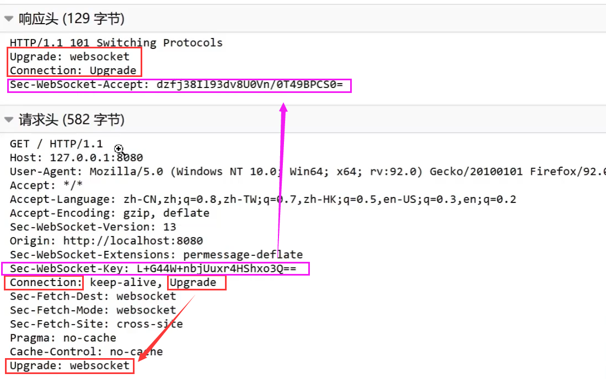

# WebSocket

## 简介

### Http通信协议

> **Http协议** 半双工协议，在同一时刻，数据信息流向是单向的，只能由客户端发起。

~~~markdown
# http解决只能由客户端发起的方法（以下3种方法都是基于http协议实现）

1. 轮询：每隔一段时间，服务器去获取客户端的数据

2. 长轮询（挂起的get/搁置的post）：每隔一段时间，去获取，但在指定的时间间隔内服务状态的连接是不断开的，解决了轮询不精准延时的问题，因为在指定时间内连接是不断开的

- 上面两种方法两者非常占用服务器资源，没有标准规范，通过自己技术实现

3. 流花技术：客户端发送一个请求，服务端发送并维护一个持续更新并保持打开的开放响应，比长轮询还要长，这个连接一直建立，每当服务器有需要交给客户端的数据时，交给后，连接依然不断开
	缺陷：相当耗费资源，增大服务器的压力，如果用了http的代理和防火墙，代理和防火墙很有可能把上一次的响应做了缓存，导致数据有偏差，数据处理就需要进行区分

- 3个方法的缺陷：随着数据数量的加大，导致延时，服务器压力大
~~~

### WebSocket通信协议

**WebSocket**是一种在单个TCP连接上进行[全双工](https://baike.baidu.com/item/全双工)通信的协议，单套接字连接，解决了http协议中不适用于实时通信的缺陷

**支持数据流**：二进制，文本

**建立连接过程**

一次握手，连接建立，第一次进行通信，借用了http协议发送的握手信息，如果客户端，服务端连接一旦建立，就会建立一个websocket连接

**Websocket通信协议特点**：待补充

~~~markdown
WebSocket相似技术补充
1. Server-sent Events(SSE):每来一次消息，推送一次，用的不多

2. SPDY:已不再维护，由HTTP/2取代，实现服务端主动给服务端推送

3. webRTC:更好的处理流数据，应用场景：如视频网站，直播的流处理
~~~

#### **Websocket和Http的请求响应图信息对比**

Http协议：

**Websocket协议：**

~~~markdown
# 1.Upgrade：若在Conncection中含有Upgrade，这一次借助http协议发送请求，请求建立时，Upgrade告诉服务器，进行协议升级，升级成websocket，响应时依然可以看到协议升级成websocket

# 2.协议为什么要升级呢，通过服务器响应头的Connection的upgrade进行标识来升级，此时连接就建立起来了

# 3.服务器依然会返回给客户端另一个消息：Sec-WebSocket-Accept-》websocket每次建立连接，服务器端都有一个唯一客户端的标识
- 标识的产生：服务器端根据客户端发送的请求中的请求头的Sec-WebSocket-Key（客户端自动生成）的hash值，服务器返回生成另外一个hash值
- 服务端Sec-WebSocket-Accept的hash值作用：代表了当前客户端和服务器端的连接，客户端是谁
~~~

 