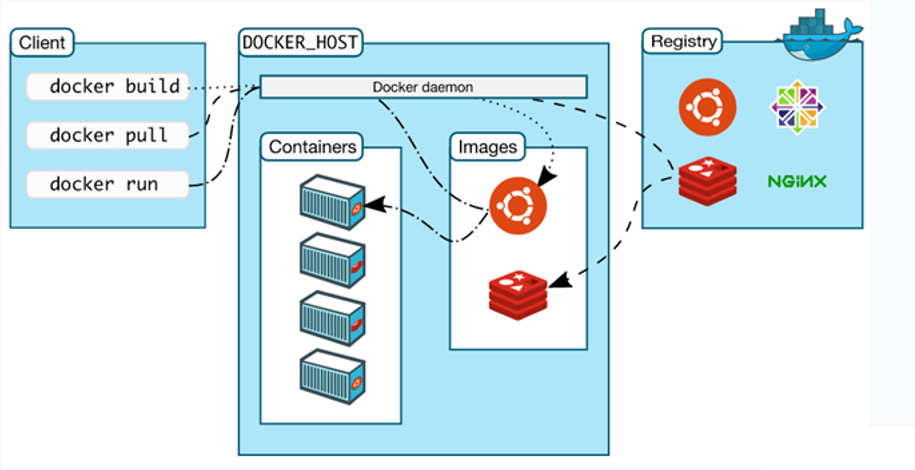

# Docker_齐

[TOC]

# 一. 容器化技术

## 1. 历史演变

**1. 物理机时代**

> 1. 部署非常慢
> 2. 成本很高
> 3. 资源浪费
> 4. 难于扩展与迁移
> 5. 受限于硬件
>
> 

**2. 虚拟机时代**

> 1. 多部署
> 2. 资源池
> 3. 资源隔离
> 4. 很容易扩展
> 5. vm需要装操作系统
>
> 

**3. 容器化时代**

> 相比虚拟机更小巧，更灵便
>
> 

**容器化技术应用场景**

> 1. 应用化的迁移方式
> 2. 统一的参数配置
> 3. 自动化部署
> 4. 应用集群监控
> 5. 开发与运维之间的沟通桥梁

## 2. Docker优势

1.开源的应用容器引擎，基于go语言开发

2.容器完全使用沙箱机制，容器开销极低

3.Docker就是容器化技术的名词

4.Docker也具备一定化职能

5.基于cs架构,拥有服务端和客户端的架构

6.Docker具备虚拟化职能：可以创建容器，还可向本地的物理机申请资源，更加方便程序的迁移与扩展。

7.Docker提供标准的应用打包的方式，集装箱是镜像文件，镜像文件中包含了所有的资源，如web引用，数据库，web应用服务器，队列等，在这个镜像中还用来描述这些应用所需要的硬件环境要求，部署后也可灵活的调整，运维工程师得到镜像文件后，方便的进行扩展与还原，马上能得到与之前一样的运行环境。这也是docker存在的意义。

~~~markdown
# 虚拟化和容器化技术混合运用场景

- 如阿里云，腾讯云的服务器性能好：采用的是虚拟机和容器化技术的实现

- 比如在阿里云购买ecs服务器，在阿里云那边就是一个虚拟机，根据应用场景不同，安装不同容器，比如购买阿里云的mysql数据库，阿里云通过容器化技术自动安装mysql容器，就得到一台mysql服务器了，这里虚拟化主要是对硬件资源的隔离，但在虚拟机中所使用到的mysql是通过容器化技术部署的
~~~

# 二. Docker简介

~~~markdown
# 1.可用资源：
- 如物理机，阿里云/腾讯云的虚拟机，看得见摸得着的称为可用资源，cpu，硬盘，内存等等，应用程序不是直接操作可用资源，而是应用程序面向docker引擎获取可用资源
# 2.Dokcer引擎：
- 获取可用资源，使得应用程序不直接面向底层资源，而是通过中间层docker引擎进行操作
	## 2.1包含的子组件：
1. docker server（docker daemon）：也称为docker demon守护进程，所有docker服务都是通过docker 		daemon完成，如容器的获取，镜像的创建等
2. REST API 通讯层：可以看成是一个小的tomcat，rest api是基于web容器提	供服务的，所以客户端和rest 	api传输的是标准的http请求和响应，server通过rest api返回给客户端结果，应用的协议：标准的web协议		http，因为使用http，docker兼容性和可扩展性都是很好的
3. docker client：docker pull 就是dokcer client的可执行文件，通过rest api向server层发送请求和指		令
# 3.应用程序
- docker引擎和java的jvm特别的像，无论是docker的应用程序，还是java的应用程序不在直接面向底层资源，而是通过中间层docker引擎进行操作
~~~

## 1. cs架构的优势

> 服务器和客户端不用安装一台电脑上，可以使运维工程师用一台电脑对很多台服务器进行管理

## 2. 镜像容器两者区别

镜像：镜像是**只读的文件**，提供了运行程序完整的软硬件资源，是应用程序的"集装箱"

容器：运行镜像的环境，如window镜像的运行环境pc物理机

## 3. 执行流程

> client：通过redis api 发送请求
>
> docker_host：接收并进行处理命令
>
> Docker daemon：容器创建，镜像获取等
>
> images：本地镜像
>
> registry：中央镜像库，大量的镜像来供使用者下载

1. client端通过rest api发送请求docker pull tomcat，Docker_Host中Docker daemon接收，查询本地仓库images是否包含该镜像，若没有去中央仓库registry拉取镜像下载到本地仓库images
2. client端通过docker run tomcat命令，创建tomcat容器

## 4. 同一镜像多容器创建

pull创建镜像文件，只读的，所以使用run创建对应的redis容器，redis容器对外暴露服务，而容器内部为一个迷你的linux系统，如果一个redis不够用，再次使用run通过dockerdemon在创建一个redis容器，两个redis容器实互不干扰的，各自拥有独立的文件系统，独立的硬件资源，一个redis停掉了，不影响另一个redis

# 二. Docker安装(tomcat8.0.52)

## 前置准备

~~~markdown
# yum install -y yum-utils device-mapper-persistent-data lvm2
-y 自动确认安装
yum-utils是yum安装的工具包，简化安装过程中设置安装源的配置过程
安装数据存储驱动包，docker内部存储通过这2个组件完成数据存储

# yum-config-manager --add-repo http://mirrors.aliyun.com/docker-ce/linux/centos/docker-ce.repo
修改yum的安装源，设置新的安装源，路径为国内阿里云的安装源
设置新的安装源目的：docker安装源默认是在国外，下载的非常慢

# yum makecache fast
让安装源自动检测速度是最快的，优先使用它
~~~

## docker安装

~~~markdown
# yum -y install docker-ce
docker-ce：开源的社区版本
-ee:收费企版
~~~

## pull失败的原因以及解决办法

~~~maridown
pull失败：从国外的docker中央仓库进行下载，中国网络特殊性，会下载失败

阿里云容器镜像服务：由阿里云作为docker镜像代理，来加速获取docker的加载速度

进入阿里云官网，搜素容器加速服务，找到镜像加速器
~~~

> 下方蓝色复制到linux中，直接自己进行加载
>
> **命令解释**
>
> sudo systemctl daemon-reload 对其server daemon重新加载
>
> sudo systemctl restart docker 重新启动docker

# 三. Docker命令

## 1. Docker镜像版本查询

版本在hub.docker.com网站中搜索查看，是否拥有对应镜像的版本，否则pull不到

> 如搜索到tomcat
>
> 官方：有图标且名称为组件名称tomcat
>
> 第三方：与其官网概念相反，不建议使用，原因：也许存在bug，恶意代码等
>
> 

> **右侧为支持的平台**，选Linux - x86 64位 （lastet）
>
> 

> 上图的的**DESCRIPTION**为提供的版本
>
> 

## 2. 基本命令

**docker pull registry :tags**

>  拉取中央仓库的镜像并下载
>
>  若存在多个版本，可通过***:tags***指定版本,不加tags讲最新的版本下载

**docker rm -f 容器id**

>  -f作用：若容器在运行，可强制删除

**docker run -p 8000:8080 tomcat** 

> 宿主机和容器的端口映射
>
> 8000为宿主机端口，容器内部的8080端口

**docker run -d -p 8000:8080 tomcat **

> run命令属于前台运行，独占状态，命令进入阻塞的状态，即命令输入不了，ctrl+c退出tomcat运行，才能继续输入命令，但是tomcat也会停止运行
>
> -d:代表后台运行(-d 放前面，放后面出错)

**docker ps -a**

> docker ps：列出当前运行的容器及其相关信息
>
> docker ps -a：列出所有的容器及其相关信息

**docker images**

> 列出本地镜像
>
> - **-a :**列出本地所有的镜像（含中间映像层，默认情况下，过滤掉中间映像层）；
> - **--digests :**显示镜像的摘要信息；
> - **-f :**显示满足条件的镜像；
> - **--format :**指定返回值的模板文件；
> - **--no-trunc :**显示完整的镜像信息；
> - **-q :**只显示镜像ID。

**docker rm -f 容器id**

> 容器id通过docker ps命令查看
>
> -f : 若此容器正在运行，强制删除容器

**docker rmi -f tomcat:tag**

> 移除镜像
>
> -f：对正在运行的容器镜像，强制移除（开发可以这么用，线上不能这么用）

**cd /var/lib/docker**

Linux下docker默认存放路径 ：var/lib/docker

> containers：容器
>
> image：镜像
>
> 

## 3. 宿主机不知道如何和内部的容器打交道解决方案

~~~markdown
- 宿主机：容纳docker的虚拟机/物理机，内部包含容器
~~~

>  解决方案：**端口映射**，通过宿主机的端口和容器的端口进行绑定
>
>  外面互联网就可以通过输入**http://宿主机ip:宿主机的port**进行访问
>
>  端口映射所提供的好处：可以换容器，只要保证宿主机映射端口不变，程序可无缝迁移，就比如tomcat服务器不想用了，换个其他的web服务器
>
>  
>
>  **netstat -tulpn 端口号查询**
>
>  > yum install net-tools 安装net组件
>  >
>  > 中间可看出通过docker proxy完成8000映射容器内部的8080端口
>
>  

## tomcat访问404问题

[tomcat404解决网址](https://www.cnblogs.com/xuanjiange/p/14155456.html)

~~~markdown
- docker exec -it 容器id /bin/bash

- 查看webapps为空，问题在这

- rm -rf webapps

- mv webapps.dist webapps

- 在通过客户端访问，ip:port
~~~

# 四. 容器内部结构

## 1. tomcat容器内部结构

## 2. 容器中的执行命令

1. **docker exec -it 容器id /bin/bash**

   > 进入容器内部
   >
   > 其内部一个迷你版的linux，内存小到只能运行tomcat
   >
   > 内部迷你版linux只提供最基本的命令，如ls，而ll却没有就是这个原因，保证内存足够小
   >
   > exec：在对应容器中执行命令
   >
   > -it：采用交互的方式命令（用于在迷你版linux上交互）

2. **cat /proc/version** 

   > 查看linux版本

3. **java -version**

   > jdk版本

4. **exit** 

   > 退出容器，返回宿主机

## 3. 容器声明周期

### 3.1 docker kill 和docker stop 区别

docker kill/stop 容器id

> kill杀死docker进程
>
> stop停止docker进程
>
> 两者各自运行docker start的区别
>
> kill后，在docker start会重新创建一个docker容器
>
> stop后，在docker start会继续停止的docker进程

### 3.2 docker pause 和docker stop区别

> docker pause：暂停服务，通过docker unpause恢复服务
>
> 
>
> docker stop：停止容器线程，通过docker start恢复该容器线程

异常情况oom内存溢出，也会将容器线程变为die,如果重启进入start状态，如果不重启进入stop状态

# 五. Dockerfile构建镜像

~~~markdown
# dockerfile镜像描述文件

1. Dockerfiler是一个包含用于组合镜像的命令文本文档，文本内容包含了一条条构建镜像所需的指令和说明
2. Docker通过读取Dockerfile中的指令按步自动生成镜像
3. docker build -t 机构/镜像(自己起名) :tags(自己定义版本) Dockerfile目录
~~~

## 1. Dockerfile自动部署Tomcat应用

**FROM tomcat :latest**

> from : 设置基准镜像，在镜像中进行扩展

**MAINTAINER xxx.com**

> maintainer：说明当前镜像由哪个人或哪个机构来维护的

**WORKDIR /usr/local/tomcat/webapps**

> workdir：用来切换工作目录，也可以理解为是cd，如果切换的目录不存，workdir会自动创建
>
> 用docker exec -it 容器id /bin/bash
>
> 进入容器后，看到容器的路径名，部署一个新的web应用，需要存放在webapps中，所以需要切换到/usr/local/tomcat/webapps

**ADD docker-web ./docker-web**

> add：将指定目录下的所有文件/目录复制到指定目录下
>
> docker-web：我们自己在客户端创建的目录
>
> ./docker-web：wordir 目录下，即/usr/local/tomcat/webapps目录下的docker-web，若不存在则创建

## 2. dockerfile简单使用

1.本地创建一个目录，里面包含dockerfile文件（不添加后缀名）和docker-web的目录

2.上传到linux，usr/images（创建images目录）

3.build 指令（生成镜像，可通过docker images命令查看）

> docker build -t zhanghp.com/mywebapp:1.0 .

4.run（生成容器并运行，run命令详细看生命周期图）

> docker run -d -p 8000:8080 zhanghp.com/mywebapp:1.0

5.客户端根据宿主机的映射端口访问里面的tomcat，自己所写的html

6.build后,mywebapp执行流程

## 3. Dockerfile两大特性

**1.分层**

> 分层进行堆叠
>
> from -> maintainer -> wordir -> add 可以把from理解为汉堡最下面的面包片，在这个面包片上添加对应的蔬菜，肉，直到add把这些覆盖上，形成一个完整的汉堡

**2.系统快照**

> 通过docker临时容易体现出来
>
> #### from->add的每一步都会生成临时容
>
> 作用：在每一步执行完后，docker都会对当前运行的系统环境生成一个快照，快照是以临时容器的方式来体现，相当于玩游戏时存档，临时容器可以理解为存档
>
> 好处：临时容器可重用，极大加快了镜像的构建速度以及节省系统资源，比如在部署一个新镜像时，前3步和之前tomcat镜像build都一样，所以只需将第四步add进行重新的临时容器构建

## 4. Dockerfile命令深入

**FORM - 基于基准镜像**

> 基准镜像：构建新镜像时，依托于哪个原有镜像进行扩展
>
> - 从远程仓库拉取tomcat镜像，并创建一个临时的容器，用于镜像的构建
> - 临时容器：用于镜像的构建，不可以直接使用
> - id：临时容器
>
> FROM scratch 不依赖于任何人基准镜像base image

**LABEL&MAINTANER - 说明信息**

> LABEL:描述信息，这些信息不会产生实质的影响，只供阅读
>
> MAINTAINER zhanghp.com
>
> LABEL version="1.0"
>
> LABEL description="一二三"

**WORKDIR - 设置工作目录**

> 工作目录可分为
>
> 1. 绝对路径
> 2. 相对路径：用"."即可代表当前路径，如**WORKDIR .**

**ADD & COPY - 赋值文件**

> copy和add本质一样，还是有区别
>
> add:支持文件的解压缩，抓取远程文件功能（不常用）

**ENV - 设置环境变量**

> ENV JAVA_HOME /usr/local/openjdk8
>
> **作用：**用JAVA_HOME常量代替了后面的路径
>
> **好处：**如果以后环境变量变了，只需改ENV中的路径一处即可，其他所有引用的地方都发生变化

**EXPOSE - 暴露容器端口**

> 将容器内部端口暴露给物理机
>
> EXPOSE 8080
>
> docker run -p 8000:8080 tomcat

**RUN&CMD&ENTRYPOINT - 运行命令**

> RUN : 在build构建时执行该命令
>
> CMD：在容器启动时执行命令
>
> ENTRYPOINT 入口点：容器启动时执行命令
>
> 

~~~markdown
# RUN - 构建时运行

- RUN yum install -y vim #shell命令格式
- RUN ["yum","install","-y","vim"]  #Exec命令格式

为什么有2个，涉及linux底层，exec命令后会替代当前的进程，推荐exec
~~~

**shell运行方式**

> 使用shell执行时，当前shell是父进程，生成一个子shell进程，在子shell中执行脚本，脚本执行完毕，退出子shell，回到当前shell
>
> 

**Exec运行方式**

> 用Exec替换当前进程，并且保持PID不变，执行完毕，直接退出，并不会退回之前的进程环境
>
> 

**ENTRYPOINT 启动命令**

> + ENTRYPOINT(入口点)用于在容器启动时执行命令
> + Dockerfile中只有最后一个ENTRYPOINT会被执行
> + ENTRYPOINT ["ps"] #推荐使用Exec格式

**CMD 默认命令**

> + CMD用于设置默认执行的命令
> + 如Dockerfile中出现多个CMD,则只有最后一个被执行
> + 如容器启动时附加指令,则CMD被忽略
> + CMD ["ps" , "-ef"] #推荐使用Exec格式

entrypoint一定被运行，cmd不一定被运行

## 5. run和cmd区别

在usr/images下创建目录，其里面创建dockerfile文件

docker run 会执行cmd ["echo","aa"]中的aa

而docker build 不会

**cmd详解**

若在docker run 后加别的命令如ls，会取代原有的cmd来执行

## 6. entrypoint和cmd

> ps -ef 查看进程的完整格式
>
> ps -aux 查看进程列表
>
> 若上面是ENTRYPOINT 而下方紧跟着cmd，会联合使用
>
> **好处：**
>
> cmd可从外界传参，比方采用aux命令显示进程列表，可通过docker run zhanghp.com/docker_run  **-aux** 替代原有dockerfile的cmd
>
> 所以此时从ps -ef -> ps -aux

## 4. dockerfile创建后，tomcat访问index无效

命令出错了

> docker build -t zhanghp.com/mywebapp:1.0 .
>
> docker run -d -p 8000:8080 zhanghp.com/mywebapp:1.0
>
> 我之前run的是tomcat：8.0.52，build也不是mywebapp，并不知道到可以自定义镜像名称

# 六. 容器间单向通信（link）

> 通过link完成容器间的单向通信

## 1. 单向通信

 **docker run -d --name web tomcat**

**docker run -d --name  database -it centos /bin/bash**

> 为什么第二个添加-it和/bin/bash
>
> 创建容器加-it和bin/bash的目的：centos创建完容器自动进入到退出的状态，若想让容器的状态一直保持运行，需要进入-it交互模式进入/bin/bash，通过-d在后台运行

**docker inspect 容器id**

> 查看容器原始信息
>
> NetworkSettings中IPAddress为所分配的虚拟ip地址
>
> 所有的ip都被docker进行管理

**两个容器间，进入一个容器后，可通过ip，ping通另一个，但用name名ping不通，需要进行网络的设置**

> **docker rm -f 容器id**	

用link绑定name通信

**docker run -d --name datatbase -it centos /bin/bash**

**docker run -d --name web --link database tomcat**

> tomcat：容器名称

进入web容器，ping database

## 为什么要用name去完成ping，而不用ip呢

> ip地址无论怎么发生变化，name还叫database，就可以连接

# 七. 容器的双向通信（Bridge网桥）

## 1. 概念

> 通过网桥bridge完成多组容器间的双向通信
>
> 双向互联：通过创建一个新的网桥，将已有的容器和网桥进行绑定，默认所有与网桥绑定的容器之间都是互联互通的

## 2. 网桥的作用

> 网桥
>
> 1.docker环境和宿主环境的通信者
>
> 2.对容器从网络层面上进行分组
>
> 把2个容器绑定到网桥上，2个容器的数据能互通

## 3. 网桥搭建

**docker run -d --name web tomcat**

**docker run -d -it -name database centos /bin/bash**

**docker ps**

**docker network ls**

> network：网络服务的命令
>
> ls：列出当前docker底层网络的信息
>
> 默认每个docker容器都会提供一个默认的网桥，网桥承担容器和外面互通的桥梁

**docker network create -d bridge my-bridge**

> 新建网络的类型：网桥
>
> 创建后，返回一个id

**docker networkd ls**

> 展示network列表信息
>
> 会出现一个my-bridge的网桥

## **4. 容器和网桥的绑定**

**docker network connect my-bridge web**

> 容器和网桥绑定
>
> my-bridge:网桥的名称
>
> web：容器的名称

**docker network connect my-bridge database**

> 两个容器就互通了
>
> 两个容器之间都绑定bridge，两个容器隶属于my-bridge的分组中

~~~markdown
# 验证：

1. 进入容器
docker exec -it 容器id /bin/bash
ping web（看是否能ping通name为web的容器）

2. 进入另一个tomcat容器
docker exec -it 容器id /bin/bash
ping database
~~~

---

## 5. 网桥实现原理

> 创建网桥的背后，在docker中，每当创建一个网桥，在宿主机上安装一个虚拟网卡，这个虚拟网卡也承担起网关的作用，web和database通过虚拟网卡绑定，在docker容器内部，就可以实现互联互通，从一个容器发出的数据，都可以通过网关找到另一个容器来接收数据，反之，同理
>
> 虚拟网卡所构成的网关就形成了一个内部通路，只要新的容器绑定到虚拟网卡上，就可以和其他绑定虚拟网卡互连互通
>
> 虚拟网卡的ip地址是虚拟，但和外部通信的话虚拟网卡需要和宿主机的物理网卡做地址转换，和外网通信

# 八. Volume容器间共享数据

> volume在计算机中翻译为数据卷

## 1. 容器间共享数据的目的

> 如果页面文件发生了变化，每个容器间都需要进行更新
>
> 

## 2.数据共享方案

> 在宿主机间开辟一块空间，被其他容器进行共享，容器内部不在持有页面文件，页面文件存放在宿主机的某一个磁盘上，通过docker环境实现多个容器间读取同一份文件，以后只需更新宿主机所创建磁盘目录中的web页面文件即可，使所有容器生效
>
> 

## 3. 数据卷volume设置

+ **Method1**

docker run --name 容器名 -v 宿主机路径:容器内挂载路径 镜像名

> 缺陷：若写错目录一个字母都带来挂载的失败，每个挂载都需要重新写一遍目录

+ **Method2**

通过创建共享容器完成挂载

1. docker create --name webpage -v /webapps:/usr/local/tomcat/webapps tomcat /bin/true

   > 创建共享容器
   >
   > -v:设置容器挂载点
   >
   > webapps为挂载点
   >
   > usr/local/tomcat/webapps:为容器内部的所要被挂载的路径
   >
   > webapps容器内部路径：usr/local/tomcat/webapps

2. docker run --volumes-from webpage --name t1 -d tomcat

   > 根据所创建共享容器webpage挂载信息使用到新的容器上
   >
   > --volumes-from：从名称获取挂载点相关信息，本质和方式一种的-v一样，只不过抽取一个挂载点

总结：

实际开发中，根据挂载容器的多少选择方式一，还是方式二

---

实操：

1. 创建客户端自定义的volume-webapps目录，里面包含html文件
2. 上传到linux的/usr/webapps
3. cd /usr/webapps
4. 创建挂载 docker run --name t1 -p 8000:8080 -d -v /usr/webaps:/usr/local/tomcat/webapps tomcat
5. 访问ip:8000/volume-webapps/index.html

查看容器内部是否含有volume-webapps

1. 进入容器内部：docker exec -it 容器id /bin/bash
2. cd webapps
3. cd volume-webapps能查看到index.html

数据卷的验证

1. cd /usr/webapps/volume-webapps
2. vim index.html
3. 修改index.html,保存
4. 直接刷新浏览器，验证成功

方式2:共享容器简化上面的过程

1. cd /usr/webapps

2. docker create --name webpage -v /usr/webapps:/usr/local/tomcat/webapps tomcat /bin/true

   > bin/true:没有含义，占位符
   >
   > 挂载点名称：webpage

3. docker run -p 8002:8080 --volumes-from webpage --name t1 -d tomcat

   > 通过制定容器的挂载点来进行端口挂载
   >
   > 挂载点的成立：抽取了目录，不用像方式1挂载时去写冗余的目录
   >
   > --volumes-from：从哪个挂载过得路径，相当于-v 挂载路径：被挂载的路径

# 九. Docker compose容器编排工具

> 通过解析脚本，自动安装ngins，tomcat，mysql容器，彼此间形成依赖联系，每个容器所需的配置文件都可进行相应的绑定

## 1. 容器编排

> 先部署哪个，在部署哪个，宿主机部署容器的过程

docker compse

1. **单机**多容器部署工具，只能在一台宿主机上进行部署，集群环境通过docker swarm或k8s来解决
2. 通过yml文件定义多容器如何部署
3. win/mac默认提供Dokcer Compose，像服务器系统，如Linux需安装centos

docker compose安装

官网：https://docs.docker.com/compose/install/

因为win和mac默认提供doker compose，所以不用安装

Linux系统安装docker compose

> 命令如下图，只有2个命令就可安装好docker compose
>
> 1.获取docker compose并安装，也许会拒绝访问，要多试几次
>
> 2.为安装的docker compose授权

docker-compose -version

> 查看docker-compose版本

## 2. 通过docker compose创建开源博客

> 根据官方步骤，依次执行
>
> https://docs.docker.com/samples/wordpress/
>
> 1. **cd /usr**
>
> 2. **mkdir wordpress**
>
> 3. **cd wordpress**
>
> 4. **vim docker-compose.yml**
>
>    
>
> 5. **添加官网所提供的的yml内容**
>
>    
>
> 6. **解析yml脚本 docker-compose up -d**
>
>    > up : 代表解析，自动部署
>    >
>    > -d : 后台执行
>    >
>    > 执行后的控制台：
>    >
>    > 
>    >
>    > 创建了2个容器
>    >
>    > 1.mysql5.7
>    >
>    > 2.wordpress：应用容器
>    >
>    > 这时使用docker ps
>    >
>    > 
>    >
>    > 在应用容器上wordpress自动做了端口映射，8000-》80
>
> 在客户端浏览器中输入ip：port（8000）
>
> 
>
> **创建完后，登录**
>
> 
>
> 登录后展示
>
> 