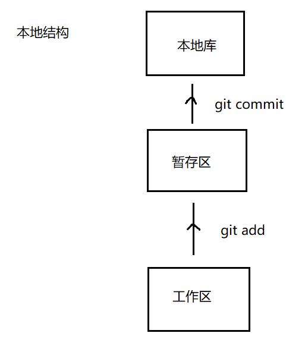

 # git

# 一. 简介

## 1.概念

> git是一个开源的，免费的分布式版本控制系统，可以高效的处理小型到大型的项目

## 版本控制的目的

> 软件开发中采用版本控制系统是个明智的选择。
> 有了它你就可以将某个文件回溯到之前的状态,甚至将整个项目都回退到过去某个时间点的状态。
> 就算你乱来一气把整个项目中的文件改的改删的删，你也照样可以轻松恢复到原先的样子。
> 但额外增加的工作量却微乎其微。你可以比较文件的变化细节,查出最后是谁修改了哪个地方,从而找出导致怪异问题出现的原因，又是谁在何时报告了某个功能缺陷等等。

# 二. 使用

## 1. 本地结构

## 2. 指令

git add name

> 文件/文件夹的名称