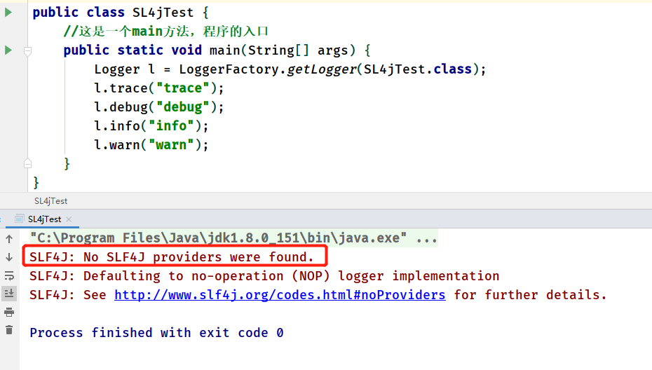
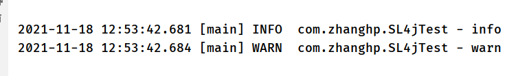

# slf4j

## 简介

**简单回顾门面模式**

slf4j是门面模式的典型应用，因此在讲slf4j前，我们先简单回顾一下门面模式，

门面模式，其核心为**外部与一个子系统的通信必须通过一个统一的外观对象进行，使得子系统更易于使用**。用一张图来表示门面模式的结构为：


门面模式的核心为Facade即门面对象，门面对象核心为几个点：

- 知道所有子角色的功能和责任
- 将客户端发来的请求委派到子系统中，没有实际业务逻辑
- 不参与子系统内业务逻辑的实现

大致上来看，对门面模式的回顾到这里就可以了，开始接下来对SLF4J的学习。

**使用slf4j原因**

我们为什么要使用slf4j，举个例子：

```
我们自己的系统中使用了logback这个日志系统
我们的系统使用了A.jar，A.jar中使用的日志系统为log4j
我们的系统又使用了B.jar，B.jar中使用的日志系统为slf4j-simple

这样，我们的系统就不得不同时支持并维护logback、log4j、slf4j-simple三种日志框架，非常不便。
```

解决这个问题的方式就是引入一个适配层，由适配层决定使用哪一种日志系统，而调用端只需要做的事情就是打印日志而不需要关心如何打印日志，slf4j或者commons-logging就是这种适配层，slf4j是本文研究的对象。

从上面的描述，我们必须清楚地知道一点：**slf4j只是一个日志标准，并不是日志系统的具体实现**。理解这句话非常重要，slf4j只做两件事情：

- 提供日志接口
- 提供获取具体日志对象的方法

slf4j-simple、logback都是slf4j的具体实现，log4j并不直接实现slf4j，但是有专门的一层桥接slf4j-log4j12来实现slf4j。

## 使用

### 依赖

~~~xml
		<!-- https://mvnrepository.com/artifact/org.slf4j/slf4j-api -->
        <dependency>
            <groupId>org.slf4j</groupId>
            <artifactId>slf4j-api</artifactId>
            <version>2.0.0-alpha5</version>
        </dependency>
~~~

### 代码语句

~~~java
public class SL4jTest {
    //这是一个main方法，程序的入口
    public static void main(String[] args) {
        Logger l = LoggerFactory.getLogger(SL4jTest.class);
        l.trace("trace");
        l.debug("debug");
        l.info("info");
        l.warn("warn");
        l.error("错误");
    }
}
~~~

运行后出现的问题

> 默认调用的logger：no-operation
>
> 不做任何操作
>
> SL4j和具体的实现绑定咋一起，可和logback等绑定咋一起



### 搭配logback

依赖包

~~~xml
		 <dependency>
            <groupId>ch.qos.logback</groupId>
            <artifactId>logback-classic</artifactId>
            <version>1.2.3</version>
        </dependency>
~~~

配置文件logback.xml

~~~xml
<?xml version="1.0" encoding="UTF-8" ?>

<configuration>

    
    <!-- 设置变量LOG_HOME，用于指定log日志文件存放的目录 -->
    <property name="LOG_HOME" value="${catalina.base}/logs/"/>

    <!-- 控制台输出 -->
    <appender name="Stdout" class="ch.qos.logback.core.ConsoleAppender">
        <!-- 日志输出编码 -->
        <layout class="ch.qos.logback.classic.PatternLayout">

            <pattern>%d{yyyy-MM-dd HH:mm:ss.SSS} [%thread] %-5level %logger{50} -%msg%n</pattern>
        </layout>
    </appender>

    <!-- 按照每天生成日志文件-->
    <appender name="RollingFile" class="ch.qos.logback.core.rolling.RollingFileAppender">

        <rollingPolicy class="ch.qos.logback.core.rolling.TimeBasedRollingPolicy">
            <!--日志文件输出的文件名-->
            <fileNamePattern>/server.%d{yyy-MM-dd}.log</fileNamePattern>
            <MaxHistory>30</MaxHistory>
        </rollingPolicy>
        <layout class="ch.qos.logback.classic.PatternLayout">

            <pattern>%d{yyyy-MM-dd HH:mm:ss.SSS} [%thread] %-5level %logger{50} -%msg%n</pattern>
        </layout>
        <!-- 日志文件最大的大小-->
        <triggeringPolicy class="ch.qos.logback.core.rolling.SizeBasedTriggeringPolicy">
            <MaxFileSize>10MB</MaxFileSize>
        </triggeringPolicy>
    </appender>


    <!-- 日志输出级别 debug  info warn  error fetel  -->
    <root level="info">
        <appender-ref ref="Stdout"/>
<!--        <appender-ref ref="RollingFile"/>-->
    </root>

    <logger name="com.msb.mapper" level="debug"></logger>

</configuration>

~~~

结果展示



### 注解@Slf4j

> 如果不想每次都写private final Logger logger = LoggerFactory.getLogger(当前类名.class); 可以用注解@Slf4j

导入lombok，logback依赖

~~~xml
 <!-- https://mvnrepository.com/artifact/org.projectlombok/lombok -->
        <dependency>
            <groupId>org.projectlombok</groupId>
            <artifactId>lombok</artifactId>
            <version>1.18.20</version>
            <scope>provided</scope>
        </dependency>
        <!-- https://mvnrepository.com/artifact/ch.qos.logback/logback-classic -->
        <dependency>
            <groupId>ch.qos.logback</groupId>
            <artifactId>logback-classic</artifactId>
            <version>1.2.3</version>
        </dependency>
~~~

java代码

~~~java
@Slf4j
public class SL4jTest {
    //这是一个main方法，程序的入口
    public static void main(String[] args) {
        try {
            int i = 1/0;
        } catch (Exception e) {
            log.error("错误:{}",e.getMessage());
        }
    }
}
~~~

