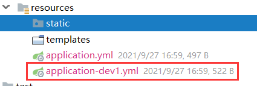
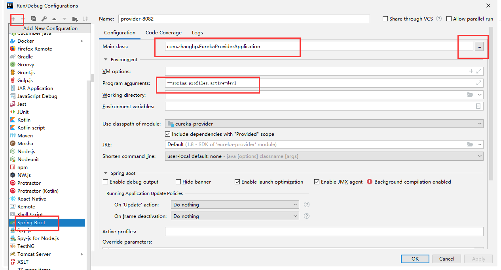
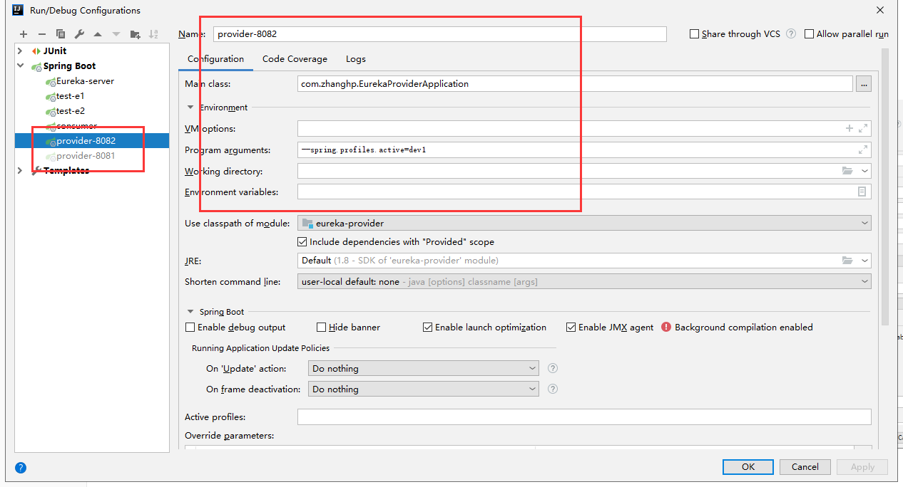

# Ribbon

SpringBoot版本：2.2.6.RELEASE

SpringCloud版本：Hoxton.SR3

> 使用最新版，切换负载均衡策略2.3.4.的关键使用不了
>
> 而且provider通过DiscoveryClient获取getInstances出现空指针异常等等一些列小问题。

# 一. 搭建Eureka-provider的集群

## 方式1

1. yml

   > 复制yml，并在名字后加"-***"




2. Edit Configurations

   > --spring.profiles.active=***





## 方式2

1. yml

   ~~~yml
   eureka:
     client:
       service-url:
         defaultZone: http://eureka-8888:8888/eureka
   ---
   spring:
     profiles: client1
     application:
       name: eureka-client
   server:
     port: 9001
   ---
   spring:
     profiles: client2
     application:
       name: eureka-client
   server:
     port: 9002
   ~~~

2. edit configurations

> 在edit configurations
>
> 找到active profiles的框里添加对应的spring.profiles

# 二. 客户端的负载均衡的Ribbon搭建

## 1. 客户端，服务端的负载均衡解释

> 软件负载均衡分为：服务端（集中式），客户端。
>
> 服务端负载均衡：在客户端和服务端中间使用代理，nginx。
>
> 客户端负载均衡：根据自己的情况做负载。Ribbon就是。
>
> 客户端负载均衡和服务端负载均衡最大的区别在于 ***服务端地址列表的存储位置，以及负载算法在哪里***。
>
> ### 客户端负载均衡
>
> 在客户端负载均衡中，所有的客户端节点都有一份自己要访问的服务端地址列表，这些列表统统都是从服务注册中心获取的；
>
> ### 服务端负载均衡
>
> 在服务端负载均衡中，客户端节点只知道单一服务代理的地址，服务代理则知道所有服务端的地址。

## 2. 搭建基本的ribbon项目

1. **Provider**

> povider：可通过@Valut("${server.port}")获取所调用的端口号

+ controller：

  ~~~java
  @RestController
  public class RibbonController {
      @Value("${server.port}")
      String port;
  
      @RequestMapping("/port")
      public String ribbon(){
          return "Hi!,我的端口："+ port;
      }
  }
  ~~~

2. **Consumer**

+ config

  ~~~java
  @Configuration
  public class RibbonConfig {
      @Bean
      public RestTemplate restTemplate(){
          return new RestTemplate();
      }
  }
  ~~~

+ controller

  ~~~jaca
  @RestController
  public class ConsumerController {
  
      @Autowired
      RestTemplate restTemplate;
      @Autowired
      LoadBalancerClient lb;
      @Autowired
      DiscoveryClient dc;
      @RequestMapping("/ribbon")
      public String ribbon(){
          // choose采取负载均衡策略
          ServiceInstance instance = lb.choose("eureka-provider");
          String url = "http://" + instance.getHost() + ":" + instance.getPort() + "/port";
          String rest = restTemplate.getForObject(url, String.class);
          return rest;
      }
  }
  ~~~

## 3. consumer切换负载均衡策略：

### 1. 自定义负载均衡策略

~~~java
package com.zhanghp.controller;

import com.netflix.discovery.converters.Auto;
import org.springframework.beans.factory.annotation.Autowired;
import org.springframework.cloud.client.ServiceInstance;
import org.springframework.cloud.client.discovery.DiscoveryClient;
import org.springframework.cloud.client.loadbalancer.LoadBalancerClient;
import org.springframework.stereotype.Controller;
import org.springframework.web.bind.annotation.RequestMapping;
import org.springframework.web.bind.annotation.RestController;
import org.springframework.web.client.RestTemplate;

import java.util.List;
import java.util.Map;
import java.util.Random;
import java.util.concurrent.atomic.AtomicInteger;

/**
 * @author: zhanghp
 * @version: 1.0
 */
@RestController
public class ConsumerController {

    private AtomicInteger ai = new AtomicInteger();
    @Autowired
    RestTemplate restTemplate;
    @Autowired
    LoadBalancerClient lb;
    @Autowired
    DiscoveryClient dc;
    // 自定义负载均衡策略
    @RequestMapping("/ribbon2")
    public String ribbon2(){
        List<ServiceInstance> instances = dc.getInstances("eureka-provider");
        // 随机策略
        ServiceInstance instance = instances.get(new Random().nextInt(instances.size()));
        // 轮询策略
        int num = ai.incrementAndGet();
        ServiceInstance instance2 = instances.get(num % instances.size());
        String url = "http://" + instance2.getHost() + ":" + instance2.getPort() + "/port";
        String rest = restTemplate.getForObject(url, String.class);
        return "success";
    }
}
~~~

### 2. **注解方式**

~~~java
@Bean
public IRule iRule(){
    //return new RoundRobinRule();
    //return new RandomRule();
    return new RetryRule();
}
~~~

### 3. **配置文件**

+ 针对服务定ribbon策略：

```sh
eureka-provider.ribbon.NFLoadBalancerRuleClassName=com.netflix.loadbalancer.RandomRule
```

+ 给所有服务定ribbon策略：

```sh
ribbon.NFLoadBalancerRuleClassName=com.netflix.loadbalancer.RandomRule
```

属性配置方式优先级高于Java代码。

### 4. **Ribbon脱离Eureka**

> 为service-sms设置 请求的网络地址列表。
>
> Ribbon可以和服务注册中心Eureka一起工作，从服务注册中心获取服务端的地址信息，也可以在配置文件中使用listOfServers字段来设置服务端地址。

~~~properties
ribbon.eureka.enabled=false
ribbon.listOfServers=localhost:8090,localhost:8091
~~~

