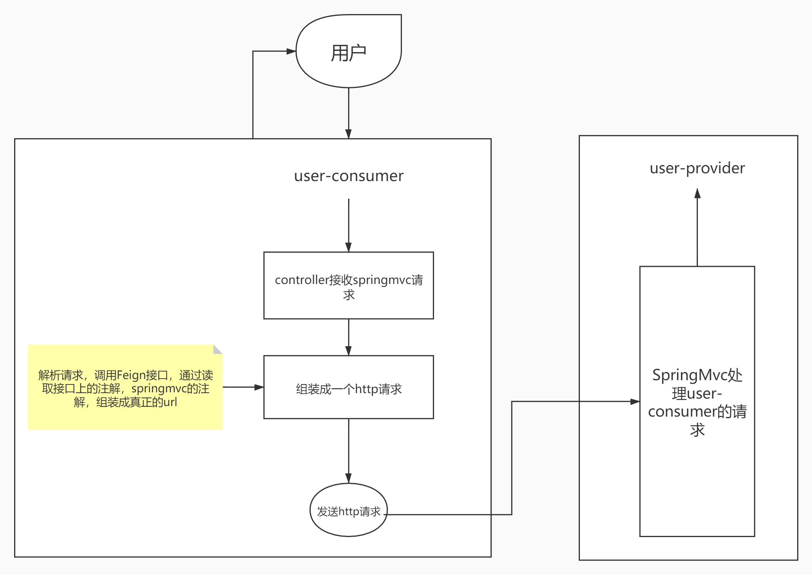
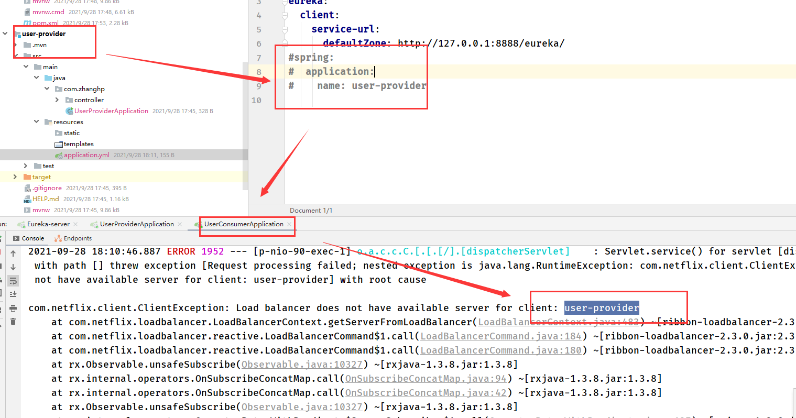
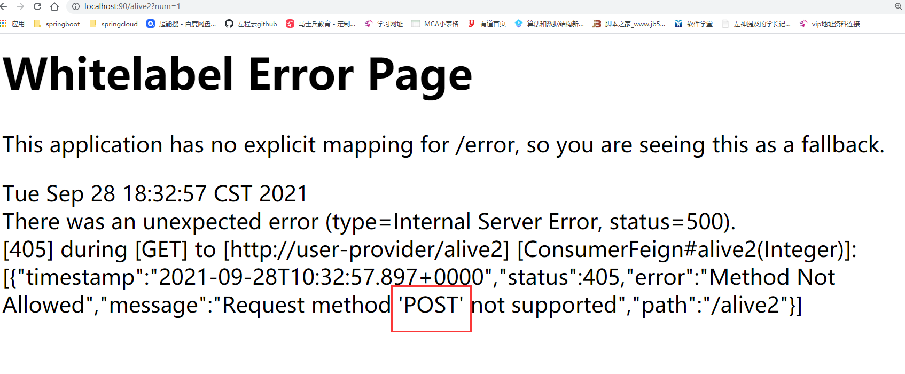
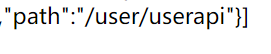

# OpenFiegn

# Feign和OpenFeign的关系

> Feign本身不支持Spring MVC的注解，它有一套自己的注解
>
> OpenFeign是Spring Cloud 在Feign的基础上支持了Spring MVC的注解，如@RequesMapping等等。
> OpenFeign的`@FeignClient`可以解析SpringMVC的@RequestMapping注解下的接口，
> 并通过动态代理的方式产生实现类，实现类中做负载均衡并调用其他服务。

# Feign流程图



# 一. OpenFiegn基本搭建（无参数传递）

# 1. user-provider

1. 导包：eureka-client，spring-web

2. yml配置：

   ~~~yml
   server:
     port: 8700
   eureka:
     client:
       service-url:
         defaultZone: http://127.0.0.1:8888/eureka/
   spring:
     application:
       name: user-provider
   ~~~

3. controller：

   ~~~java
   @RestController
   public class ProviderController {
       @GetMapping("/alive")
       public String alive(){
           return "success";
       }
   }
   ~~~

# 2. user-consumer

1. 导包：eureka-client，spring-web，openFiegn

2. yml配置：

   ~~~yml
   server:
     port: 90
   eureka:
     client:
       service-url:
         defaultZone: http://127.0.0.1:8888/eureka/
   ~~~

3. Feign配置

   ~~~java
   // user-provider的spring.application.name
   @FeignClient(name = "user-provider")
   public interface ConsumerFeign {
       @GetMapping("/alive")
       public String alive();
   }
   ~~~

4. controller

   ~~~java
   @RestController
   public class ConsumerController {
       @Autowired
       ConsumerFeign consumerFeign;
       @GetMapping("/alive")
       public String alive(){
           return consumerFeign.alive();
       }
   }
   ~~~

5. 启动器上添加**@EnableFeignClients**

# 3.启动Feign可能出现的问题

若未配置user-provider的yml中spring.application.name则会出现下面异常：



# 二. OpenFeign有参数传递

> Feign默认所有带参数的请求都是Post，想要使用指定的提交方式需引入依赖

~~~xml
		<dependency>
            <groupId>io.github.openfeign</groupId>
            <artifactId>feign-httpclient</artifactId>
        </dependency>
~~~

否则会出现下面的坑（get请求变为post请求）：



---

## 1. user-provider

+ **controller**

```
@GetMapping("/alive2")
public String alive2(Integer num){
    System.out.println(num);
    return "success";
}
```

## 2. user-consumer

+ **Feign接口**

  > Feign通过读取接口上的注解，SpringMvc的注解,重新组装真正的Url
  >
  > 1. 参数必须与provider参数名一致
  > 2. 需添加@RequstParam（Hoxton.SR9的版本不需要添加）

  ```
  @GetMapping("/alive2")
  public String alive2(@RequestParam Integer num);
  ```

+ **Controller**

  ~~~java
  	@GetMapping("/alive2")
      public String alive2(Integer num){
          return consumerFeign.alive2(num);
      }
  ~~~

## 3. 参数类型

+ map类型：需要添加@RequestParam，否则传入空值

  ~~~java
  	/**
       * 参数为map
       * @param map
       * @return
       */
      @GetMapping("/map")
      public String map2(@RequestParam Map<Integer, String> map) {
          System.out.println(map);
          System.out.println(map.get("num"));
          System.out.println(map.get("name"));
          return "success";
      }
  ~~~

+ 对象：

  > 需用post请求，用@RequestBody接收
  >
  > 不用get请求的原因：1.ie对url有长度限制 2.数据暴露，不安全

  ~~~java
  	/**
       * 参数为对象
       * @param person
       * @return
       */
      @PostMapping("/person")
      public String map2(@RequestBody Person person) {
          System.out.println(person);
          return "success";
      }	
  ~~~

  

# 三. 公共api服务接口创建

## 1. UserApi

+ 导包： spring-web

+ api接口：

  ~~~java
  @RequestMapping("/user")
  public interface UserApi {
      
      @GetMapping("/userapi")
      public String userApi();
      
      @GetMapping("/parameter")
      public String parameter(Integer num);
  }
  ~~~

## 2. User-provider

+ 导包：

  ```xml
  <dependency>
      <groupId>com.zhanghp</groupId>
      <artifactId>user</artifactId>
      <version>0.0.1-SNAPSHOT</version>
  </dependency>
  ```

+ controller实现api接口

  > 1. 实现UserApi接口后，**Feign**会把接口UserApi上方的**@RequestMapping("/user")**继承过来，就相当于在该controller上方添加了一个@RequestMapping，所以单独访问的话需要添加user路径
  >
  >    如：{ip}:{port}/user/alive
  >
  > 2. 如果在controller上方已经声明@RequestMapping（"/uuuu"）
  >
  >    则**实现的接口的@RequqestMapping失效了**，如：{ip}:{port}/uuuu/alive。
  >
  > 但**不推荐**第二种做法，原因如下：
  >
  > 1. 公共api的服务接口，就是要定义这些的。
  > 2. Feign接口就不继承userapi接口了，否则user-consumer的访问路径会出错，user-consumer继承后会把接口UserApi上方的**@RequestMapping("/user")**继承过来，自动在url添加上该路径
  
  ~~~java
  @RestController
  @RequestMapping("/uuuu")
  public class ProviderController implements UserApi {
      
      /**
       * 重写userapi接口的无参方法
       * @return
       */
      @Override
      public String userApi() {
          System.out.println("UserAPi");
          return "userApi";
      }
  
      /**
       * 重写userapi接口的有参方法
       * @param num
       * @return
       */
      @Override
      public String parameter(Integer num) {
          System.out.println(num);
          return "success_num";
      }
  }
  ~~~

## 3. user-consumer

+ 导包：

  ~~~xml
  <dependency>
      <groupId>com.zhanghp</groupId>
      <artifactId>user</artifactId>
      <version>0.0.1-SNAPSHOT</version>
  </dependency>
  ~~~

+ Feign接口继承该接口

  > 继承后会把接口UserApi上方的**@RequestMapping("/user")**继承过来，自动在url添加上该路径(**不知道是不是Feign自动给拼接的**)，如
  >
  > 
  >
  > 所以Feign接口里的方法只写对应的user-provider方法上方的@RequestMapping就行
  
  ~~~java
  @FeignClient(name = "user-provider")
  public interface ConsumerFeign extends UserApi {
      @GetMapping("/userapi")
    String userApi();
  
      @GetMapping("/parameter")
      String parameter(@RequestParam Integer num);
  }
  ~~~

# 四. OpenFeign的负载均衡

## 1. user-provider创建集群

## 2. user-consumer

+ 可直接进行对user-provider轮询的负载均衡
+ yml负载均很的相关配置

~~~properties
#连接超时时间(ms)
ribbon.ConnectTimeout=1000
#业务逻辑超时时间(ms)（可通过让provider睡，测试超出时间）
ribbon.ReadTimeout=2000
#同一台实例最大重试次数,不包括首次调用
ribbon.MaxAutoRetries=3
#重试负载均衡其他的实例最大重试次数,不包括首次调用
ribbon.MaxAutoRetriesNextServer=3
#是否所有操作都重试
ribbon.OkToRetryOnAllOperations=false
~~~

