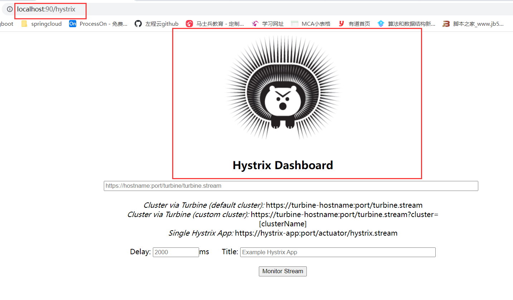
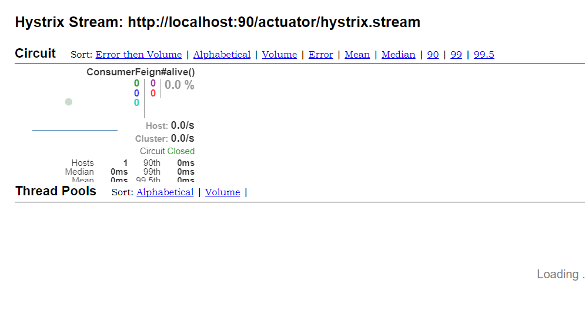

# 4. Hystrix

# 概念

> 服务降级，熔断，限流

spring cloud 用的是 hystrix，是一个容错组件。

Hystrix实现了 超时机制和断路器模式。

Hystrix是Netflix开源的一个类库，用于隔离远程系统、服务或者第三方库，防止级联失败，从而提升系统的可用性与容错性。主要有以下几点功能：

1. 为系统提供保护机制。在依赖的服务出现高延迟或失败时，为系统提供保护和控制。
2. 防止雪崩。
3. 包裹请求：使用HystrixCommand（或HystrixObservableCommand）包裹对依赖的调用逻辑，每个命令在独立线程中运行。
4. 跳闸机制：当某服务失败率达到一定的阈值时，Hystrix可以自动跳闸，停止请求该服务一段时间。
5. 资源隔离：Hystrix为每个请求都的依赖都维护了一个小型线程池，如果该线程池已满，发往该依赖的请求就被立即拒绝，而不是排队等候，从而加速失败判定。防止级联失败。
6. 快速失败：Fail Fast。同时能快速恢复。侧重点是：（不去真正的请求服务，发生异常再返回），而是直接失败。
7. 监控：Hystrix可以实时监控运行指标和配置的变化，提供近实时的监控、报警、运维控制。
8. 回退机制：fallback，当请求失败、超时、被拒绝，或当断路器被打开时，执行回退逻辑。回退逻辑我们自定义，提供优雅的服务降级。
9. 自我修复：断路器打开一段时间后，会自动进入“半开”状态，可以进行打开，关闭，半开状态的转换。前面有介绍。

# 一. Hystrix 独立隔离使用，脱离springcloud

> 在main方法独立运行

+ 导包

~~~xml
		<dependency>
            <groupId>org.springframework.cloud</groupId>
            <artifactId>spring-cloud-starter-netflix-hystrix</artifactId>
        </dependency>
~~~

+ 创建类继承HystrixCommand

~~~java
 com.netflix.hystrix.HystrixCommand;
~~~

+ 代码

~~~java
public class HystrixTest extends HystrixCommand {
    protected HystrixTest(HystrixCommandGroupKey group) {
        super(group);
        // TODO Auto-generated constructor stub
    }

    public static void main(String[] args) {

   //	HystrixTest hystrixTest = new 	HystrixTest(HystrixCommandGroupKey.Factory.asKey("ext"));
        /**
         * execute()：以同步阻塞方式执行run()。以demo为例，调用execute()后，
         * hystrix先创建一个新线程运行run()，
         * 	接着调用程序要在execute()调用处一直阻塞着，直到run()运行完成
         */
        //	System.out.println("result:" + hystrixTest.execute());

        /**
         * queue()：以异步非阻塞方式执行run()。以demo为例，
         * 	一调用queue()就直接返回一个Future对象，
         * 	同时hystrix创建一个新线程运行run()，
         * 	调用程序通过Future.get()拿到run()的返回结果，
         * 	而Future.get()是阻塞执行的
         */
        Future<String> futureResult = new HystrixTest(HystrixCommandGroupKey.Factory.asKey("ext")).queue();
        String result = "";
        try {
            result = futureResult.get();
        } catch (InterruptedException e) {
            e.printStackTrace();
        } catch (ExecutionException e) {
            e.printStackTrace();
        }

        System.out.println("程序结果："+result);
  

    @Override
    protected Object run() throws Exception {
        // TODO Auto-generated method stub
        // try
        System.out.println("执行逻辑");
        int i = 1/1;
        return "xxoo";
    }

    @Override
    //catch  备用逻辑
    protected Object getFallback() {
        // TODO Auto-generated method stub
        return "getFallbackgetFallback";
    }
}
~~~

# 二. RestTemplate

+ 导包

~~~xml
		<dependency>
            <groupId>org.springframework.cloud</groupId>
            <artifactId>spring-cloud-starter-netflix-hystrix</artifactId>
        </dependency>
~~~

+ 创建restService类

~~~java
@Service
public class RestService {
    @Autowired
    RestTemplate restTemplate;

    @Autowired
    LoadBalancerClient lb;

    @HystrixCommand(defaultFallback = "back")
    public String restalive() {
        ServiceInstance instance = lb.choose("user-provider");
        return restTemplate.getForObject("http://"+instance.getHost()+":" + instance.getPort() + "/alive", String.class);
    }

    // fallback方法
    public String back(){
        return "RestService --  back";
    }
}
~~~

+ config 

~~~java
@Configuration
public class RestTemplateConfig {
    @Bean
    public RestTemplate res(){return new RestTemplate();}
}
~~~

+ controller调用

~~~java
@RestController
public class ConsumerController  {
	@Autowired
    RestService restService;
    @RequestMapping("/restalive")
    public String restalive(){
        return restService.restalive();
    }
}
~~~

+ 启动类添加

~~~java
@EnableCircuitBreaker
~~~

> 也可添加@EnableHystrix，里面集成了@EnableCircuitBreaker
>
> 

# 三. OpenFeign整合Hystrix

## 1. 基本搭建

>  不需导包，OpenFeign整合了Hystrix

1. yml

~~~yml
feign:
	hystrix:
		enabled: true
~~~

2. Feign接口添加fallback

~~~java
@FeignClient(name = "user-provider",fallback = UserProviderBack.class)
~~~

3. 创建fallback的返回类

> 继承Feign接口
>
> 添加@Component注解

~~~java
@Component
public class UserProviderBack implements ConsumerFeign {
    @Override
    public String userApi() {
        return "服务降级降级降级";
    }
}
~~~

## 2. 注意事项

对外的服务接口user-api上不能设置@RequestMapping，会报错

~~~java
org.springframework.beans.factory.BeanCreationException: Error creating bean with name 'requestMappingHandlerMapping' defined in class path resource [org/springframework/boot/autoconfigure/web/servlet/WebMvcAutoConfiguration$EnableWebMvcConfiguration.class]: Invocation of init method failed; nested exception is java.lang.IllegalStateException: Ambiguous mapping. Cannot map 'com.zhanghp.operfiegn.ConsumerFeign' method 
com.zhanghp.operfiegn.ConsumerFeign#parameter(Integer)
to {GET /user/parameter}: There is already 'userProviderBack' bean method
~~~

## 3. FallbackFactory

> 可检查具体错误，有一个异常参数throwable可打出异常信息
>
> 而fallback不能

1. 把Feign上的fallback改成fallbackFactory

~~~java
@FeignClient(name = "user-provider",fallbackFactory = UserProviderBackFactory.class)
~~~

2. 创建fallbackFactory的返回类

> 该类继承FallbackFactory<Feign接口类>
>
> 添加@Component
>
> 通过返回 new feign接口重写其中的方法（匿名内部类）

~~~java
@Component
public class UserProviderBackFactory implements FallbackFactory<ConsumerFeign> {

    @Override
    public ConsumerFeign create(Throwable throwable) {
        return new ConsumerFeign() {
            @Override
            public String userApi() {
                System.out.println(throwable);
                // 打印throwable字符串
                System.out.println(ToStringBuilder.reflectionToString(throwable));
                // 打印其具体异常错误
                throwable.printStackTrace();
                // 判断异常类型
                if (throwable instanceof FeignException.InternalServerError) {
                    // 获得该异常的详细信息
                    return "远程服务器出错 " + throwable.getLocalizedMessage();
                }
                return "服务降级降级降级";
            }
        };
    }
}
~~~

# 四. 线程池隔离与信号量隔离

## yml相关的配置

~~~yml
hystrix.command.default.execution.isolation.strategy 隔离策略，默认是Thread, 可选Thread｜Semaphore
thread 通过线程数量来限制并发请求数，可以提供额外的保护，但有一定的延迟。一般用于网络调用
semaphore 通过semaphore count来限制并发请求数，适用于无网络的高并发请求
hystrix.command.default.execution.isolation.thread.timeoutInMilliseconds 命令执行超时时间，默认1000ms
hystrix.command.default.execution.timeout.enabled 执行是否启用超时，默认启用true
hystrix.command.default.execution.isolation.thread.interruptOnTimeout 发生超时是是否中断，默认true
hystrix.command.default.execution.isolation.semaphore.maxConcurrentRequests 最大并发请求数，默认10，该参数当使用ExecutionIsolationStrategy.SEMAPHORE策略时才有效。如果达到最大并发请求数，请求会被拒绝。理论上选择semaphore size的原则和选择thread size一致，但选用semaphore时每次执行的单元要比较小且执行速度快（ms级别），否则的话应该用thread。
semaphore应该占整个容器（tomcat）的线程池的一小部分。
~~~

## 1. 线程隔离

> 线程池隔离技术，是用 Hystrix 自己的线程去执行调用
>
> 好处：
>
> 1. 线程池自带的4个失败策略
> 2. 异步请求，解决线程的worker阻塞
> 3. 线程池异常隔离（一个线程池出现异常，不影响另外的）

## 2. 信号量隔离

> 信号量隔离主要维护的是Tomcat的线程，不需要内部线程池，更加轻量级。信号量隔离技术，是直接让 tomcat 线程去调用依赖服务。信号量隔离，只是一道关卡，信号量有多少，就允许多少个 tomcat 线程通过它，然后去执行。
>
> 好处：
>
> 1. 轻量级的（比atomicInteger更轻量级）
> 2. 速度更快
>
> 使用场景：
>
> 压榨系统性能，代码健壮，不可能出现异常的情况下

**信号量绑定的是Tomcat里的线程池**

## 3. servlet3.0和servlet3.1

> servlet3.0的work线程**不可复用**
>
> servlet3.1的work线程**可复用**

#  线程隔离的代码实现

## 配置

+ 导包

  > 引入actuator的原因：服务监控hystrix

  ~~~xml
  		<dependency>
              <groupId>org.springframework.boot</groupId>
              <artifactId>spring-boot-starter-actuator</artifactId>
          </dependency>
  		<dependency>
              <groupId>org.springframework.cloud</groupId>
              <artifactId>spring-cloud-starter-netflix-hystrix-dashboard</artifactId>
          </dependency>
  ~~~

+ 启动类上添加@EnableHystrixDashboard

+ yml开启服务监控

  ~~~yml
  management:
    endpoints:
      web:
        exposure:
          include: '*'
  ~~~

## 实现

1. **{ip}:{port}/actuator/hystrix.stream**

   > 没有访问请求时
   >
   > 会一直ping

   

   > 有访问请求时
   >
   > 会一直ping

   

2. **{ip}:{port}/hystrix**

**面板输入{ip}:{port}/actuator/hystrix.stream**

> 若没有请求

> 有请求

# 信号量隔离

## 配置

> default：默认全部
>
> 可以修改成具体方法

~~~yml
hystrix:
  command:
    default:
      execution:
        isolation:
          strategy: SEMAPHORE
~~~

## 实现界面

> 因为是信号量隔离，所以线程池是没有的

