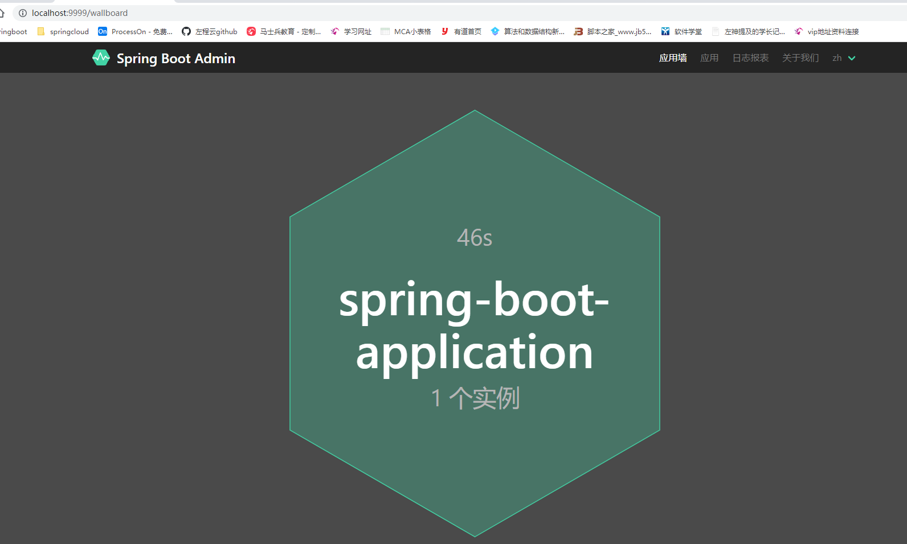
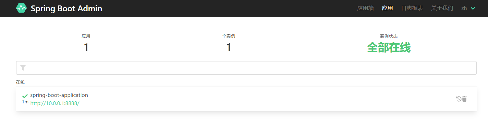
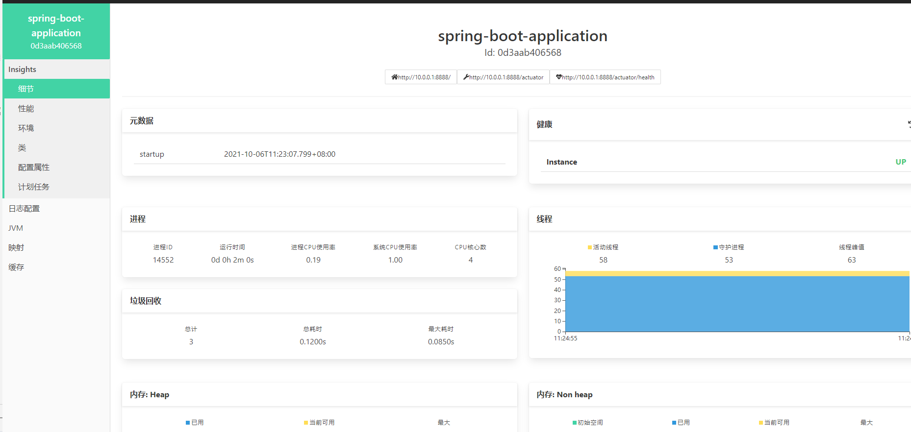
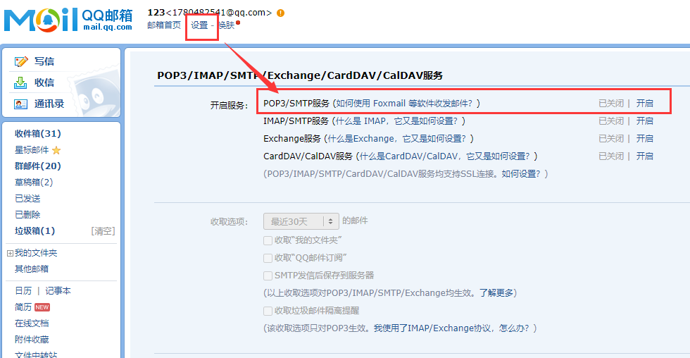
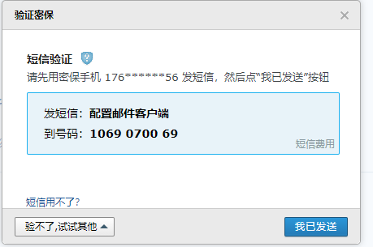
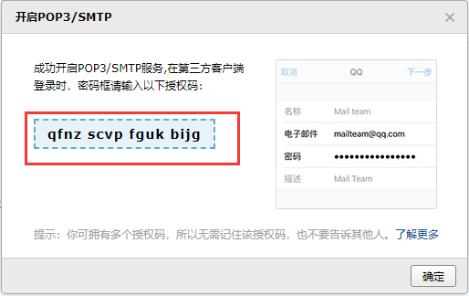
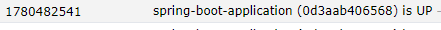
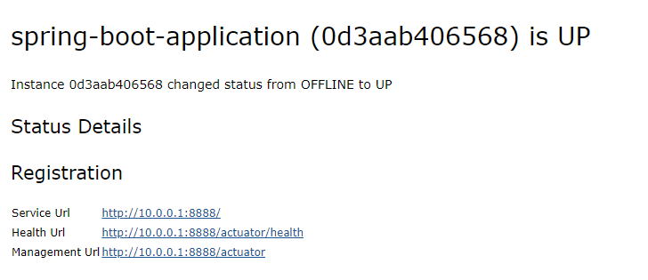

# 6. admin

# 一. 配置

## 1. admin模块配置

创建admin模块

导包：

> spring-boot-starter

~~~xml
    <dependencies>
        <dependency>
            <groupId>de.codecentric</groupId>
            <artifactId>spring-boot-admin-starter-server</artifactId>
            <version>2.2.1</version>
        </dependency>
        <!-- admin ui -->
        <dependency>
            <groupId>de.codecentric</groupId>
            <artifactId>spring-boot-admin-server-ui</artifactId>
            <version>2.2.1</version>
        </dependency>
        <dependency>
            <groupId>org.springframework.boot</groupId>
            <artifactId>spring-boot-starter-actuator</artifactId>
        </dependency>
    </dependencies>
~~~

yml配置

~~~yml
management:
  endpoints:
    health:
      show-details: always
    web:
      exposure:
        include: '*'
server:
  port: 9999
spring:
  application:
    name: admin
~~~

## 2. 其他被健康检查的模块

导包：

> eureka-server不需要actuator，其server包含有actuator

~~~xml
		<dependency>
            <groupId>de.codecentric</groupId>
            <artifactId>spring-boot-admin-starter-client</artifactId>
            <version>2.2.1</version>
        </dependency>
		<dependency>
            <groupId>org.springframework.boot</groupId>
            <artifactId>spring-boot-starter-actuator</artifactId>
        </dependency>
~~~

yml配置：

~~~yml
management:
  endpoints:
    web:
      exposure:
        include: '*'
    health:
      show-details: always
spring:
  boot:
    admin:
      client:
        url: http://localhost:9999
~~~

## 3. 访问admin界面

访问http://localhost:9999

点进应用

点进其在线的一个模块

# 二. 邮箱邮件通知

## 1. admin模块

导包：

~~~xml
		<dependency>
			<groupId>org.springframework.boot</groupId>
			<artifactId>spring-boot-starter-mail</artifactId>
		</dependency>
~~~

yml所需添加的配置

~~~yml
spring:
  boot:
    admin:
      notify:
        mail:
          to: 1780482541@qq.com
          # 必须和mail.username的账号一致
          from: 1780482541@qq.com
  application:
    name: admin
  mail:
    host: smtp.qq.com
    username: 1780482541
    password: swplhlzhileacfgi
    properties:
      mail:
        smpt:
          auth: true
          starttls:
            enable: true
            required: true
~~~

## 2. POP3/SMTP服务的密码获取

进入mail.qq.com

点进开启

发送验证码后，获得yml配置中，mail.password

## 3. 下线其服务

进入收件

点进去

# 钉钉通知（看明哥笔记）

