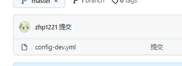

# 7. config

# 配置

## config模块配置

导包

~~~yml
		<dependency>
            <groupId>org.springframework.cloud</groupId>
            <artifactId>spring-cloud-config-server</artifactId>
        </dependency>
        <dependency>
            <groupId>org.springframework.cloud</groupId>
            <artifactId>spring-cloud-starter-netflix-eureka-server</artifactId>
        </dependency>
~~~

yml

~~~Yml
spring:
  cloud:
    config:
      server:
        git:
          uri: https://github.com/zhp1221/spring-cloud-config.git
      label: master
  application:
    name: config
management:
  endpoints:
    web:
      exposure:
        include: '*'
server:
  port: 9998
eureka:
  client:
    service-url:
      defaultZone: http://eureka-server:8888/eureka
~~~

启动器上添加@EnableConfigServer

## git

创建git仓库，把其https的地址，添加到yml中的git.uri

上传文件到git仓库中

# 访问

通过{ip}:{port}/分支/文件名

