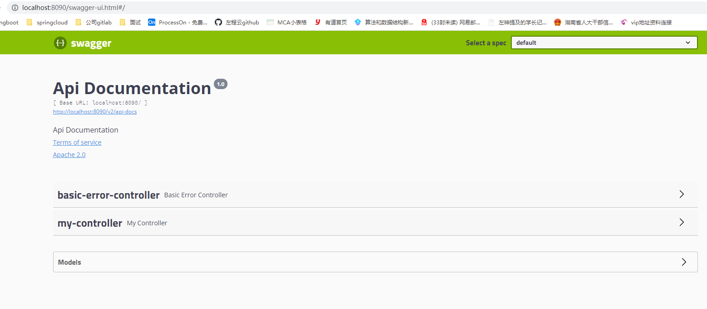
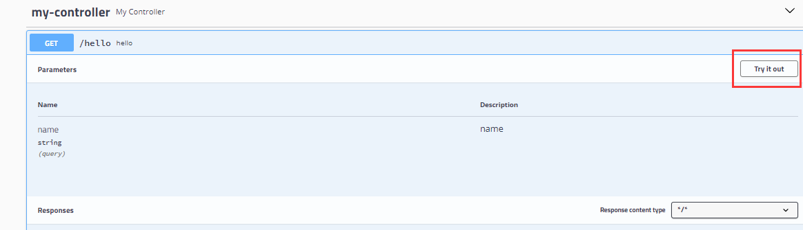
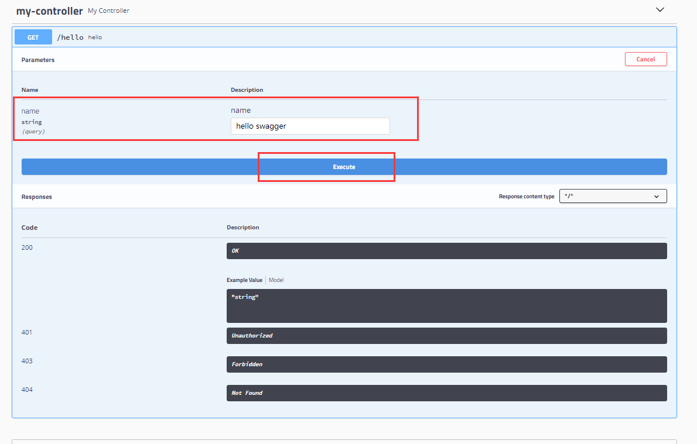
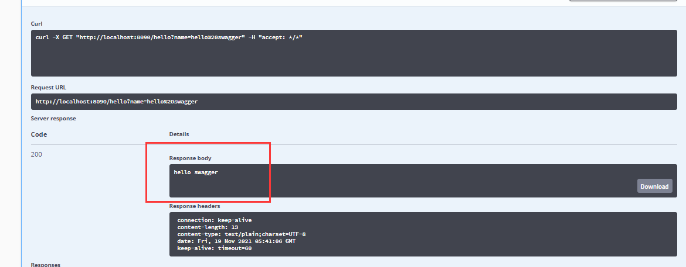
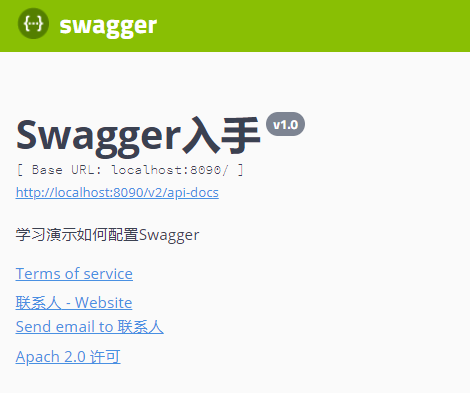
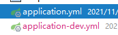
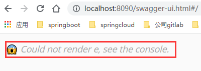
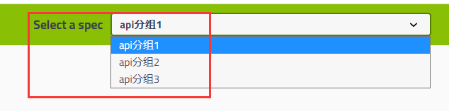

# Swagger2

[TOC]

## 快速入手

### 搭建

> 搭建springboot项目，略

+ 导入swagger所需依赖

  ~~~xml
  		<!-- https://mvnrepository.com/artifact/io.springfox/springfox-swagger2 -->
          <dependency>
              <groupId>io.springfox</groupId>
              <artifactId>springfox-swagger2</artifactId>
              <version>2.9.2</version>
          </dependency>
          <!-- https://mvnrepository.com/artifact/io.springfox/springfox-swagger-ui -->
          <dependency>
              <groupId>io.springfox</groupId>
              <artifactId>springfox-swagger-ui</artifactId>
              <version>2.9.2</version>
          </dependency>
  ~~~

+ controller代码

  ~~~java
  @RestController
  public class MyController {
      // 需指定使用的请求方法
      @GetMapping("/hello")
      public String hello(String name){
          return name;
      }
  }
  ~~~

+ 启动器添加@EnableSwagger2

+ **localhost:port/swagger-ui.html**

### 结果展示

### 方法接口参数调用

1. 点击my-controller,点击Try it out

2. 添加参数

3. 返回的值

## 配置swagger

### 配置版本，文档信息

新建config类

~~~java
@Configuration
public class SwaggerConfiguration {
    /**
     * Swagger的实例bean为docket，配置docket来配置Swagger具体参数
     *
     * @return
     */
    @Bean
    public Docket docket(){
                // 配置版本swagger2.0 可通过源码查询配置参数
        Docket docket = new Docket(DocumentationType.SWAGGER_2)
                // 配置文档信息
                .apiInfo(apiInfo());
        return docket;
    }

    /**
     * 配置文档信息
     * 
     * @return
     */
    private ApiInfo apiInfo(){
        // 配置联系人信息
        Contact contact = new Contact("联系人","http://xxx.xx.com/联系人访问连接","联系人邮箱");
        ApiInfo apiInfo = new ApiInfo(
                "Swagger入手", // 标题
                "学习演示如何配置Swagger", // 描述
                "v1.0", // 版本
                "http://terms.service.url/组织链接", // 组织链接
                contact, // 联系人信息
                "Apach 2.0 许可", // 许可
                "http://许可链接", // 许可连接
                new ArrayList<>()// 扩展
        );
        return apiInfo;
    }
}
~~~

**展示界面**

### 配置扫描接口及路径过滤

**config配置**

> .select().apis().build()一起用

~~~java
@Configuration
public class SwaggerConfiguration {
	@Bean
    public Docket docket(Environment environment){
        // 配置版本
        Docket docket = new Docket(DocumentationType.SWAGGER_2)
                // 通过。select()方法,去配置扫描接口，RequestHandlerSelectors配置如何扫描接口
                .select()
                // basePackage()配置扫描接口
                .apis(RequestHandlerSelectors.basePackage("com.zhanghp.xxx"))
                // any()扫描所有接口
                .apis(RequestHandlerSelectors.any())
                // none()不扫描接口
                .apis(RequestHandlerSelectors.none())
                // withMethodAnnotation 只扫描方法上的注解 @GetMapping
                .apis(RequestHandlerSelectors.withMethodAnnotation(GetMapping.class))
                // withClassAnnotation 只扫描类上的注解 @Controller
                .apis(RequestHandlerSelectors.withClassAnnotation(Controller.class))
            	// 配置路径过滤，只扫描以/zhanghp开头的接口
            	.path(PathSelectors.ant("/zhanghp/**"))
                .build();      
        return docket;
    }
}
~~~

### 配置Swagger启动开关-》测试环境/上线环境

**config配置**

~~~java
	@Bean
    public Docket docket(Environment environment){
        // 设置显示swagger的环境
        Profiles dev = Profiles.of("dev");
        // 判断是否处于该环境
        boolean flag = environment.acceptsProfiles(dev);
        // 配置版本
        Docket docket = new Docket(DocumentationType.SWAGGER_2)
                // 配置文档信息
                .apiInfo(apiInfo())
            	//是否显示Swagger页面
                .enable(flag);
        return docket;
    }
~~~

**yml配置**

> 建立dev测试环境，切换环境配置yml自行搜索

~~~yml
spring:
  profiles:
    active: dev
~~~

**展示界面**

> 若为true，和上面界面展示一样

> 若为false，则为下图

### 配置Api分组

**config配置**

~~~java
@Configuration
public class SwaggerConfiguration {
    @Bean
    public Docket docket1(){
        return new Docket(DocumentationType.SWAGGER_2)
                // 配置分组
                .groupName("api分组1");
    }
    @Bean
    public Docket docket2(){
        return new Docket(DocumentationType.SWAGGER_2)
                // 配置分组
                .groupName("api分组2");
    }
    @Bean
    public Docket docket3(){
        return new Docket(DocumentationType.SWAGGER_2)
                // 配置分组
                .groupName("api分组3");
    }
}
~~~

**展示界面**

### 实体配置

> 只要实体类在**请求接口**的返回值上（即使是泛型），就能映射到实体项中：

~~~java
@ApiModel("学生类")
public class Student{
    @ApiModelProperty("id")
    private Integer id;
    @ApiModelProperty("名称")
    private String name;
}
~~~

**常用注解**

| Swagger注解                                            | 简单说明                                             |
| ------------------------------------------------------ | ---------------------------------------------------- |
| @Api(tags = "xxx模块说明")                             | 作用在模块类上                                       |
| @ApiOperation("xxx接口说明")                           | 作用在接口方法上                                     |
| @ApiModel("xxxPOJO说明")                               | 作用在模型类上：如VO、BO                             |
| @ApiModelProperty(value = "xxx属性说明",hidden = true) | 作用在类方法和属性上，hidden设置为true可以隐藏该属性 |
| @ApiParam("xxx参数说明")                               | 作用在参数、方法和字段上，类似@ApiModelProperty      |

## 其他皮肤

> 添加依赖
>
> 通过各自皮肤不同的请求路径即可访问，layer界面整洁
>
> 如http://localhost:8080/docs.html

~~~xml
<!-- 引入swagger-ui-layer包 /docs.html-->
<dependency>
   <groupId>com.github.caspar-chen</groupId>
   <artifactId>swagger-ui-layer</artifactId>
   <version>1.1.3</version>
</dependency>
<!-- 引入swagger-ui-layer包 /document.html-->
<dependency>
   <groupId>com.zyplayer</groupId>
   <artifactId>swagger-mg-ui</artifactId>
   <version>1.0.6</version>
</dependency>
<!-- 引入swagger-bootstrap-ui包 /doc.html-->
<dependency>
   <groupId>com.github.xiaoymin</groupId>
   <artifactId>swagger-bootstrap-ui</artifactId>
   <version>1.9.1</version>
</dependency>
~~~

